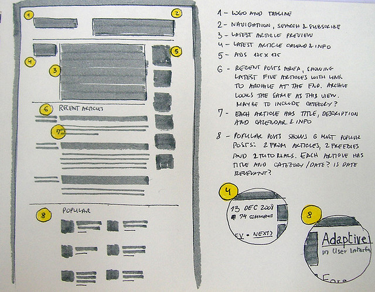

# My INF 7420 Project

I am going to build a portfolio site. The main purpose of this project will be to showcase my work and help me find a job right before I graduate.

## Wireframes

I value planning so here are some wireframes to show how the site architecture and layout could possible be.

Header - will include my navigation menu and my name

Navigation Menu - will include links to other pages like a contact form

Main Content - will talk about why I chose Libraryland and highlight my skills

Footer - will include copyright information
